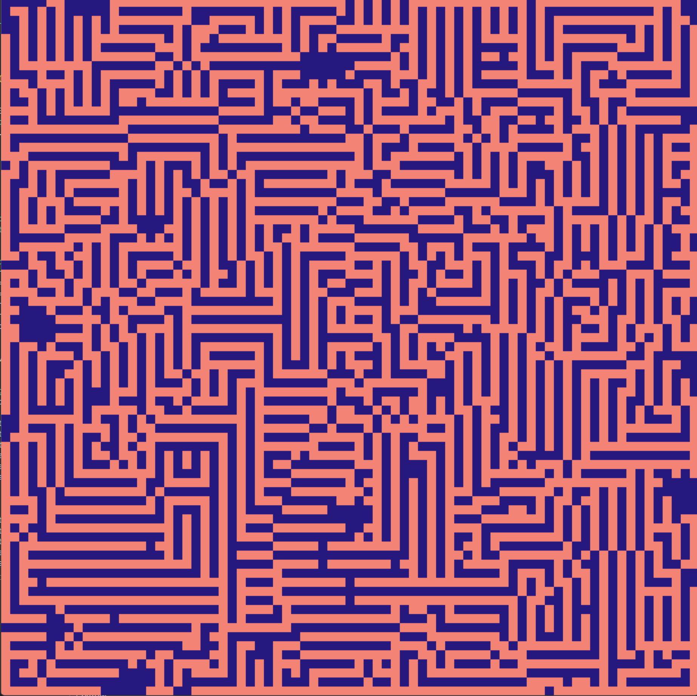
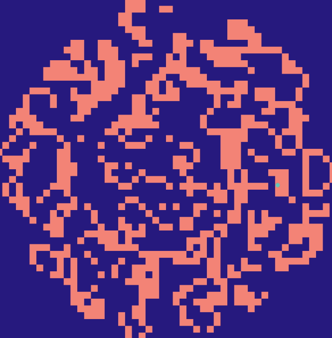

# Conway's game of life

# IF YOU HAVE NO ATTENTION SPAN IMAGES BELOW

completely inspired by carykh's video

messing around + research, this is very interesting and so much to explore

if you want to run the sims on your machine you need python 3 and pygame

```bash
python3 -m pip install pygame
python3 conway/base.py
```

or

```shell
pip install pygame
python conway/base.py
```

replace `base.py` with whatever file you want to run

btw if u know programming avert your gaze bruh its not great im writing quickly for ui not for the readability or maintainability of code

## Links

carykh video "The Conway Multiverse" https://www.youtube.com/watch?v=QK_KZv-YyOc

Zipf's law https://en.wikipedia.org/wiki/Zipf%27s_law

The Zipf Mystery https://www.youtube.com/watch?v=fCn8zs912OE

Processing 4 https://processing.org/

cellular automata that mirrors B37/S1234 "mice in corridors" https://devinacker.github.io/celldemo rule 18 (sierpinski triangle if started from 1 cell)

## Notes

Rulestrings in the notation B{α}/S{β}

alpha is a set of numbers which can include 0-8 inclusive, number of adj living cells to a dead cell that allows a birth

beta is similar, but its the number of adj living cells which allow a preexisting living cell to continue living

thus, rulestring can be stored as an 18 bit bitmask (and thus unique 2^18 rulestrings)

Cary only analyses connected rulestrings (continuous, thus at most 1 switch) which makes up a small amount (0.9%) of all rulestrings

also, non-square tilemaps could be interesting e.g. hexagon(or every 2nd row of squares shifted half a unit) or triangle maps and the set could be 0-6 or 0-3 depending on the tiles and tessellation

further explore B36/S23 "HighLife" and B3678/S34678 "Day and Night"

B345678/S2345678 is so funny

## Cool/program

~~implement~~ done

~~B3/S12345 and B3/1234 for cool maze~~ done

~~B34/S23 (A World on Fire)~~ done

data analysis for "Life Without Death" B3/S0123456789 - Famous Ladder [ehh tmr]

growth analysis (1/3rd the speed of light, etc)

---

Bo Burnham - A World on fire https://www.youtube.com/watch?v=1ws33f6qys4

# Folder structure

`base.py` - base implementation of original b3/s23 conway's game of life

right click delete
left click draw
space to toggle play

shift for step
r for random
esc close
backspace for clear

+ bigger
- smaller

i might add screenshotting and recording

`maze.py` - base but its maze (b3/12345)

`big_sun.py` - big sun but its b345678/s2345678

image
  |
  |
  v

maze


fire


demos
  |
  |
  v

`maze_demo.mp4` - maze demo

<video controls src="maze_demo.mp4" title="Maze Demo"></video>

`big_sun_demo.mp4` - big sun demo

<video controls src="big_sun_demo.mp4" title="Maze Demo"></video>

`fire_demo.mp4` - fire demo

uhh epilepsy warning flashing and stuff